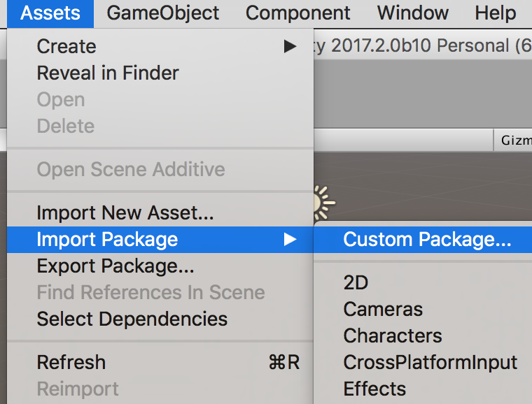
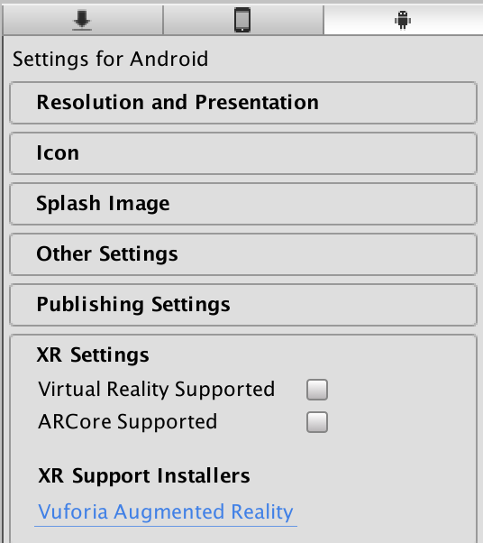
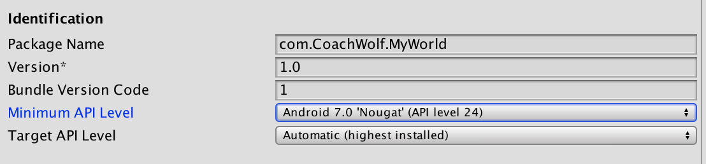
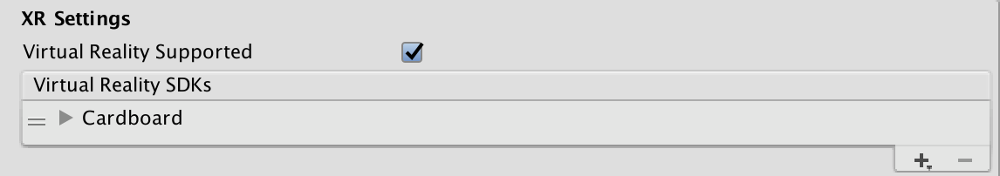

# my-world

In this project, you will be using the Unity Asset Store to create your own Virtual Reality environments.

## Creating a new Unity Project

Aight, we've been through this hella times now ----- but here are the steps to create a new Unity project, ready to be built as a Google Cardboard app. 

Create a new project, and name it "my-world"

  
 Pic 

  

### Import the GoogleVR SDK

Go to Assets > Import Package > Custom Package and select the GoogleVRForUnity_1.100.1.unitypackage

  
 Pic 

  

Remember to scroll down to "Plugins", and deselect that pesky "libs" folder before clicking Import.

  
 Pic 

  

### Set the Target Platform

Cool, now let's tell Unity that we will be building a Virtual Reality app for Android by setting the Target Platform.

* Go to File > Build Settings
* Select "Android"
* Click "Switch Platform"

### Configure the Player Settings

Now, with the Build Settings window still open, click "Player Settings" and it will pop open.

  
 Pic 

  

* Click "Other Settings"
* Change the Package Name to "com.YourName.MyWorld"
* Change the Minimum API Level to "Android 7.0 'Nougat' (API level 24)" 

  
 Pic 

  

* Close "Other Settings" and Click "XR Settings"
* Select "Virtual Reality Supported"
* Click the "+" icon to add the "Cardboard" SDK

  
 Pic 

  

