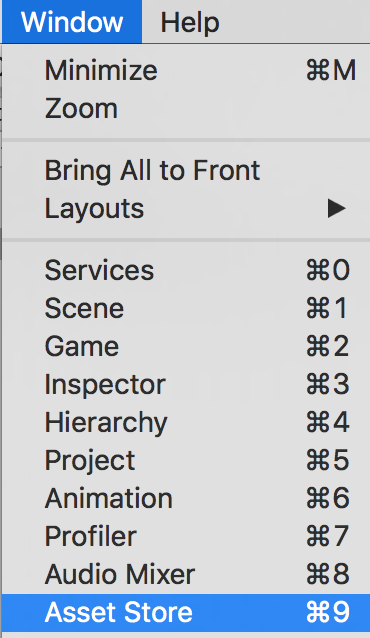
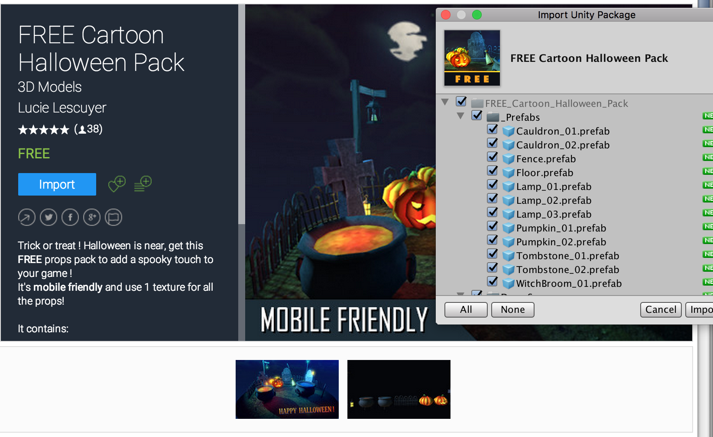

# my-world

In this project, you will be using the Unity Asset Store to create your own Virtual Reality environments.

## Creating a new Unity Project

Aight, we've been through this hella times now ----- but here are the steps to create a new Unity project, ready to be built as a Google Cardboard app. 

Create a new project, and name it "my-world"

<details>
  <summary> Pic </summary>
  
</details>


### Import the GoogleVR SDK

Go to Assets > Import Package > Custom Package and select the GoogleVRForUnity_1.100.1.unitypackage

<details>
  <summary> Pic </summary>
  
</details>

##### Deselect libs folder

Remember to scroll down to "Plugins", and deselect that pesky "libs" folder before clicking Import.

<details>
  <summary> Pic </summary>
  
</details>

### Set the Target Platform

Cool, now let's tell Unity that we will be building a Virtual Reality app for Android by setting the Target Platform.

* Go to File > Build Settings
* Select "Android"
* Click "Switch Platform"

<details>
  <summary> Pic </summary>
  
</details>

### Configure the Player Settings

Now, with the Build Settings window still open, click "Player Settings" and it will pop open.

<details>
  <summary> Pic </summary>
  
</details>

##### Other Settings

* Click "Other Settings"
* Change the Package Name to "com.YourName.MyWorld"
* Change the Minimum API Level to "Android 7.0 'Nougat' (API level 24)" 

<details>
  <summary> Pic </summary>
  
</details>

##### XR Settings

* Close "Other Settings" and Click "XR Settings"
* Select "Virtual Reality Supported"
* Click the "+" icon to add the "Cardboard" SDK

<details>
  <summary> Pic </summary>
  
</details>

## Creating the Ground (optional)

If your world will have a ground, here's how you can create one.

##### Add a cube

* Add a Cube GameObject to your scene, and name it "Ground"
* Set the position to x: 0, y: -1, z: 0
* Set the scale to x: 200, y: 0, z: 200

<details>
  <summary> Pic </summary>
  
</details>


Now you can drag and drop a Material or Texture (blue color, brick, grass, etc.) to your Ground

## Asset Store

Go to Window > Asset Store to open the Unity Asset Store

<details>
  <summary> Pic </summary>
  
</details>

##### Search for anything you want!

* Search and press "Free Only" to filter for free assets #ImBroke
* Click on an asset pack to download & import into your project

<details>
  <summary> Pic </summary>
  
  
</details>

##### Add Movement Script (extra)

* Create a script named "AutoWalk"
* Delete EVERYTHING inside to leave a blank page
* Replace it all with this code 

```c#
using System.Collections;
using System.Collections.Generic;
using UnityEngine;

public class AutoWalk : MonoBehaviour {

	int speed = 3;

	// Use this for initialization
	void Start () {
		
	}
	
	// Update is called once per frame
	void Update () {
		transform.position = transform.position + Camera.main.transform.forward * speed * Time.deltaTime;
	}


}
```

* Drag the script on to your PlayerCamera
* Turn your head to move around your world

##### Add Audio (extra)

* Download an audio clip you would like to have in your world
* Import the audio clip into Unity (Import New Asset > Select Your Audio File)
* Create an Audio Source GameObject in your hiearchy (Audio > Audio Source)
* Click the "Audio Clip" button to scroll and select your file
* Make sure "Play on Awake" and "Loop" are selected (if you want that)


## Build


