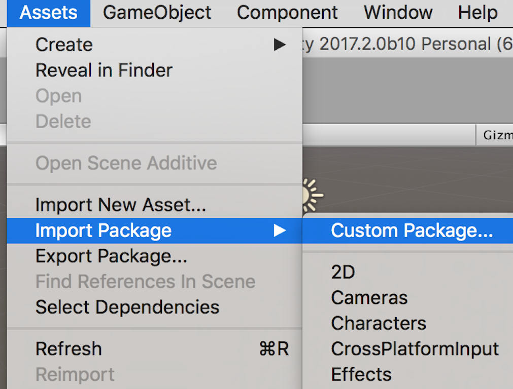

# my-world

In this project, you will be using the Unity Asset Store to create your own Virtual Reality environments.

## Creating a new Unity Project

Aight, we've been through this hella times now ----- but here are the steps to create a new Unity project, ready to be built as a Google Cardboard app. 

  
 Pic 

### Import the GoogleVR SDK

Go to Assets > Import Package > Custom Package and select the GoogleVRForUnity_1.100.1.unitypackage

  
 Pic 

